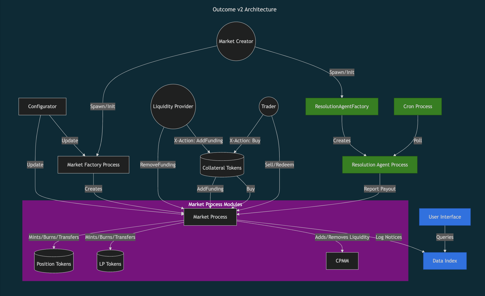

# Outcome v2

Outcome v2 is a new decentralized automated market maker and prediction market protocol enabling permissionless market creation and autonomous, oracle-free resolution. All markets and their outcomes are permanently stored on Arweave and AO.

## Quickstart

Get started with Outcome v2 by installing AOS, loading the package, and interacting with markets.

### 1. Install AOS
Ensure the AOS runtime is installed:

```bash
yarn global add https://get_ao.g8way.io
```

### 2. Load Outcome
Load the Outcome package into AOS:
```bash
aos --load src/outcome.lua
```

### 3. Mint Test Collateral

Mint **Test Collateral tokens** to create markets on testnet.

#### Run
```lua
Outcome.tokenMint(Outcome.testCollateral, "1000000000000000") 
```

#### Expected Result
```lua
{
  Quantity = "1000000000000000",
  Block-Height = 1612508,
  Action = "Mint-Notice",
  MessageId = "kuLUM8a06p4MBnUgpuXGQBU-14I-fOD3Ai91CboLThM",
  Timestamp = 1739887893528,
  Recipient = "Hyfdqip2vz03K5-3zfB-ybrQCMBT-EQSFpEIvC_6by8"
}
```

### 4. Create a Market
Once tokens are staked, spawn a new prediction market.

#### Parameters
- `collateralToken`: Token used for collateral (set to `Outcome.testCollateral` for Quickstart).
- `resolutionAgent`: Address of the resolution agent (set to `ao.id` for Quickstart).
- `dataIndex`: Address for where to send prediction market logs (set to `ao.id` for Quickstart).
- `outcomeSlotCount`: Number of possible outcomes (must be `2` for outcome.gg visibility).
- `question`: Market question (e.g., `"$A0 surpasses $AR market cap by the end of 2025"`).
- `rules`: Market rules.
- `category`: Market category (e.g., `"Crypto"`).
- `subcategory`: Market subcategory (e.g., `"Prices"`).
- `logo`: Arweave transaction ID of the LP token logo image.
- `logos`: Aweave transaction IDs of the position token logo images.
- `eventId`: The event ID for market groups, set to `nil` if not applicable.
- `creatorFeeBps`: Creator fee in basis points (e.g., `250` for a `2.5%` fee).
- `creatorFeeTarget`: Address receiving the creator fee (set to `ao.id` for Quickstart).

#### Run
```lua
res = Outcome.marketFactorySpawnMarket(
  Outcome.testCollateral,
  ao.id,
  ao.id,
  2,
  "$A0 surpasses $AR market cap by the end of 2025",
  "Market resolved via https://www.coingecko.com using AO Core's native HTTP integration",
  "Crypto",
  "Prices",
  "UkS-mdoiG8hcAClhKK8ch4ZhEzla0mCPDOix9hpdSFE",
  {"UkS-mdoiG8hcAClhKK8ch4ZhEzla0mCPDOix9hpdSFE", "UkS-mdoiG8hcAClhKK8ch4ZhEzla0mCPDOix9hpdSFE"},
  nil,
  250,
  ao.id
)
```

#### Expected Result
```lua
{
  Rules = "Market resolved via https://www.coingecko.com using AO Core's native HTTP integration",
  ResolutionAgent = "nWx096_XneRb6TlvIadeeLQ_RF2LPxogQyl_2tNR-P4",
  Logo = "UkS-mdoiG8hcAClhKK8ch4ZhEzla0mCPDOix9hpdSFE",
  CollateralToken = "jAyJBNpuSXmhn9lMMfwDR60TfIPANXI6r-f3n9zucYU",
  DataIndex = "nWx096_XneRb6TlvIadeeLQ_RF2LPxogQyl_2tNR-P4",
  Action = "Spawn-Market-Notice",
  Original-Msg-Id = "0-cRVofFMjOGyzqfc2t0HwtexkBekLe3d0bOjg0jLbc",
  Creator = "nWx096_XneRb6TlvIadeeLQ_RF2LPxogQyl_2tNR-P4",
  Question = "$A0 surpasses $AR market cap by the end of 2025",
  Subcategory = "Prices",
  Timestamp = 1741428466002,
  MessageId = "iTnyZt9SiBerbrCCvXWHm2amkwf7JC8aNaW_EsGHkPc",
  CreatorFeeTarget = "nWx096_XneRb6TlvIadeeLQ_RF2LPxogQyl_2tNR-P4",
  Logos = '["UkS-mdoiG8hcAClhKK8ch4ZhEzla0mCPDOix9hpdSFE","UkS-mdoiG8hcAClhKK8ch4ZhEzla0mCPDOix9hpdSFE"]',
  CreatorFee = 250,
  Block-Height = 1624539,
  OutcomeSlotCount = 2,
  Category = "Crypto"
}
```

### 5. Get Market Process ID
Retrieve the market process ID using the original message ID.

> Wait 1-2 seconds for the process to spawn before retrieving the ID.

#### Run
```lua
originalMsgId = res["Original-Msg-Id"]
res = Outcome.marketFactoryGetProcessId(originalMsgId)
market = res.ProcessId
```

#### Expected Result
```lua
{
  ProcessId = "MFUPbtanZgdXMQrmeXMnN7qnsN5s2vZAcAp3FuDEaIc",
  Block-Height = 1612507,
  Original-Msg-Id = "ykZi8Sh-IJoyvP7XrZ2ayXsA4STEiDy5mOoLCCiBibU",
  Timestamp = 1739887616685,
  MessageId = "hrIWFO5xTV98W-ScUAaYJ80BLE4VvUwnaGkdtFKBA2M"
}
```

### 6. Initialize the Market
Once a market has been spawned, it must be initialized.

#### Run
```lua
Outcome.marketFactoryInitMarket()
```

#### Expected Result
```lua
{
  MarketProcessIds = { "MFUPbtanZgdXMQrmeXMnN7qnsN5s2vZAcAp3FuDEaIc" },
  Action = "Init-Market-Notice",
  MessageId = "tbESFtEP3Lrr6fBmGMOqklIdMcex3BFqUFkJCRp3Iz0",
  Timestamp = 1739887635868,
  Block-Height = 1612507
}
```

### 7. Fund the Market and Set Initial Probabilities
Provide liquidity and define the starting probability distribution.

#### Parameters
- `market`: The market process ID (variable set to `market`above).
- `collateralToken`:  Token used for collateral (use `Outcome.testCollateral` for Quickstart).
- `fundingAmount`: The quantity of tokens to supply.
- `distribution`: Initial probability distribution (e.g., `{60, 40}` for 60% IN, 40% OUT).

#### Run
```lua
Outcome.marketAddFunding(
  market,
  Outcome.testCollateral,
  "100000000000000",
  {60, 40}
)
```

#### Expected Result
```lua
{
  X-OnBehalfOf = "Hyfdqip2vz03K5-3zfB-ybrQCMBT-EQSFpEIvC_6by8",
  MessageId = "PyMclTSI_s3N8QKv9eKrXRhy9Z1yCYAR8tAtlajel2s",
  Recipient = "MFUPbtanZgdXMQrmeXMnN7qnsN5s2vZAcAp3FuDEaIc",
  Quantity = "100000000000000",
  X-Distribution = "[60,40]",
  Timestamp = 1739887656056,
  Action = "Debit-Notice",
  Block-Height = 1612507,
  X-Action = "Add-Funding",
  Collateral = "jAyJBNpuSXmhn9lMMfwDR60TfIPANXI6r-f3n9zucYU"
}
```

### 7. Calc Buy Amount
Calculate how many position tokens to expect in return for an investment of collateral.

#### Parameters
- `market`: Market process ID (variable set to market above).
- `collateralToken`: Token used for collateral (use `Outcome.testCollateral` for Quickstart).
- `investmentAmount`: The quantity of collateral tokens to spend.
- `positionId`: ID of the position being purchased (e.g., `"1"` for "IN").

#### Run
```lua
res = Outcome.marketCalcBuyAmount(
  market,
  "1000000000000",
  "1"
)
```

#### Expected Result
```lua
{
  PositionId = "1",
  BuyAmount = "2453270434054",
  InvestmentAmount = "1000000000000",
  MessageId = "SFeWEN7nFq0JKX_pQS5LIqhTUF30sWQItGeMVCqAFeE",
  Timestamp = 1739887683076,
  Block-Height = 1612508
}
```

### 8. Buy Outcome Positions
Trade outcome positions.

> We use `res.BuyAmount` from the previous step for `minPositionTokensToBuy`. In a live trading environment, you may want to set this slightly lower to prevent failed transactions if the price moves against you.

#### Parameters
- `market`: Market process ID (variable set to market above).
- `collateralToken`: Token used for collateral (use `Outcome.testCollateral` for Quickstart).
- `investmentAmount`: The quantity of collateral tokens to spend.
- `positionId`: ID of the position being purchased (e.g., `"1"` for "IN").
- `minPositionTokensToBuy`: Minimum number of position tokens to buy.

#### Run
```lua
Outcome.marketBuy(
  market,
  Outcome.testCollateral,
  "1000000000000",
  "1",
  res.BuyAmount
) 
```

#### Expected Result
```lua
{
   X-MinPositionTokensToBuy = "2453270434054",
   X-OnBehalfOf = "Hyfdqip2vz03K5-3zfB-ybrQCMBT-EQSFpEIvC_6by8",
   MessageId = "Ug66pt9A6HJX6Y9W8-G-w8ORMf1sqDETKJSVCoWc2rg",
   Recipient = "MFUPbtanZgdXMQrmeXMnN7qnsN5s2vZAcAp3FuDEaIc",
   Quantity = "1000000000000",
   Collateral = "jAyJBNpuSXmhn9lMMfwDR60TfIPANXI6r-f3n9zucYU",
   Timestamp = 1739887722694,
   Action = "Debit-Notice",
   Block-Height = 1612508,
   X-Action = "Buy",
   X-PositionId = "1"
}
```

### 9. Resolve Market
Finalize the market outcome by reporting the payout distribution.

> This function is callable in Quickstart because we set the resolution agent to `ao.id`.

#### Parameters
- `market`: Market process ID (variable set to market above).
- `payout`: Payout distribution, where each value represents the fraction of the total payout assigned to each outcome (e.g., `{1, 0}` means 100% to IN and 0% to OUT).

#### Run
```lua
Outcome.marketReportPayouts(
  market,
  {1, 0}
)
```

#### Expected Result
```lua
{
  Block-Height = 1612508,
  Timestamp = 1739887760967,
  Action = "Report-Payouts-Notice",
  ResolutionAgent = "Hyfdqip2vz03K5-3zfB-ybrQCMBT-EQSFpEIvC_6by8",
  PayoutNumerators = { 1, 0 },
  MessageId = "2a9DuV5YIdvg4ncAZkW-zUds5vxFBeGt6BQLZ7hMyTQ"
}
```

### 10. Redeem Positions
Claim winnings in collateral by redeeming outcome positions.

#### Run
```lua
Outcome.marketRedeemPositions(market)
```

#### Expected Result
```lua
{
  GrossPayout = "2453270434054",
  Block-Height = 1612508,
  Collateral = "jAyJBNpuSXmhn9lMMfwDR60TfIPANXI6r-f3n9zucYU",
  Action = "Redeem-Positions-Notice",
  MessageId = "ojiLvEhKooljDfFdGrYbj5kQFa77Izcv9gt-WgAAC8g",
  Timestamp = 1739887786254,
  NetPayout = "2330606912350"
}
```

## Architecture

Outcome v2 follows a transient-style architecture, where each market operates as an independent process, executed with `market.lua` and initialized with market-specific parameters.

Markets are created permissionlessly via `marketFactory.lua`, gated by `ocmToken.lua` staking.

Market resolution is autonomous via `resolutionAgent.lua`, with optional support for single-signer and perpetual (zero-resolution) markets.

Core processes are **ownerless**, with `configurator.lua` managing time-gated updates through token governance.



## Contracts

| Contract                | Purpose                                                                                         |
| ----------------------- | ----------------------------------------------------------------------------------------------- |
| configurator.lua        | Stages time-delayed protocol updates. |
| cronRunner.lua          | Manages cron jobs: adding, removing and executing scheduled tasks. |
| market.lua              | Handles all prediction market functionality in a single process. |
| marketFactory.lua       | Spawns prediction markets permissionlessly, gated by utility token staking. |
| ocmToken.lua            | Rewards activity, gates market creation, and governs protocol updates. |
| dataIndex.lua           | Stores protocol logs and enables complex queries. |
| resolutionAgent.lua     | Autonomously resolves markets, supporting single-signer and zero-resolution (perpetual) markets. |

## Roles

| Role    | Name                      | Purpose                                 |
| --------| ------------------------- | --------------------------------------- |
| **`A`** | **Admin**                 | Executes `Configurator` actions.        |
| **`C`** | **Configurator**          | Manages and enforces protocol-level updates. |
| **`M`** | **Moderator**             | Moderates non-critical content. |
| **`R`** | **Resolution Agent**      | Unique to each market, responsible for finalising payouts. |
| **`V`** | **Viewer**                | Executes complex SQL queries. |

### Configurator

| Action                | Required Role                    | Required Tags                          | Optional Tags                   | Result                 | 
| --------------------- | -------------------------------- |-------------------------------------- | ------------------------------- | ---------------------- | 
| `Info`  | | | | `Info-Response` |  
| `Stage-Update`        | `A` | `UpdateProcess`: Valid Arweave address<br>`UpdateAction`: String | `UpdateTags`: Valid stringified Key-Value JSON<br>`UpdateData`: Valid Key-Value JSON | `Stage-Update-Notice` |
| `Unstage-Update`      | `A` | `UpdateProcess`: Valid Arweave address<br>`UpdateAction`: String | `UpdateTags`: Valid stringified Key-Value JSON<br>`UpdateData`: Valid Key-Value JSON | `Unstage-Update-Notice` | 
| `Action-Update`       | `A` | `UpdateProcess`: Valid Arweave address<br>`UpdateAction`: String | `UpdateTags`: Valid stringified Key-Value JSON<br>`UpdateData`: Valid Key-Value JSON | `Action-Update-Notice` |
| `Stage-Update-Admin`  | `A` | `UpdateAdmin`: Valid Arweave address | | `Stage-Update-Admin-Notice` | 
| `Unstage-Update-Admin`| `A` | `UpdateAdmin`: Valid Arweave address | | `Unstage-Update-Admin-Notice` |  
| `Action-Update-Admin` | `A` | `UpdateAdmin`: Valid Arweave address | | `Action-Update-Admin-Notice` | 
| `Stage-Update-Delay`  | `A` | `UpdateDelay`: Integer greater than 0 | | `Stage-Update-Delay-Notice` |
| `Unstage-Update-Delay`| `A` | `UpdateDelay`: Integer greater than 0 | | `Unstage-Update-Delay-Notice` | 
| `Action-Update-Delay` | `A` | `UpdateDelay`: Integer greater than 0 | | `Action-Update-Delay-Notice` |

### Cron Runner

| Action                | Required Role                    | Required Tags                          | Optional Tags                   | Result                 | 
| --------------------- | -------------------------------- |-------------------------------------- | ------------------------------- | ---------------------- | 
| `Info`      || | | `Info-Response` |
| `Add-Job`   | `A` | `ProcessId`: Valid Arweave address | | `Add-Job-Notice` |
| `Add-Jobs`   | `A` | `ProcessId`: Valid JSON Array of Arweave addresses | | `Add-Jobs-Notice` |
| `Remove-Job`   | `A` | `ProcessId`: Valid Arweave address | | `Remove-Job-Notice` |
| `Remove-Jobs`   | `A` | `ProcessId`:  Valid JSON Array of Arweave addresses | | `Remove-Jobs-Notice` |
| `Run-Jobs`   | `A` | | | `Run-Jobs-Notice` |

### Market

> An action marked with a star `(*)` represents the `X-Action` tag included in a `Transfer` targetting the market's collateral token with the market as recipient.

| Action                | Required Role                    | Required Tags                          | Optional Tags                   | Result                 | 
| --------------------- | -------------------------------- |-------------------------------------- | ------------------------------- | ---------------------- | 
| `Info`      || | | `Info-Response` |
| `Add-Funding(*)`        || `Quantity`: Integer greater than 0<br>`Recipient`: Valid Arweave address<br>`X-Distribution`: Valid JSON Array of Integers greater than 0 (**exclude after initial funding or the transaction will fail**) | `X-OnBehalfOf`: Valid Arweave address<br>`SendInterim`: String | `Debit-Notice`<br>`Credit-Notice`<br>`Add-Funding-Notice`<br>`Log-Funding-Notice` |
| `Remove-Funding`      || `Quantity`: Integer greater than 0 | `OnBehalfOf`: Valid Arweave address<br>`SendInterim`: String | `Remove-Funding-Notice`<br>`Log-Funding-Notice`  |
| `Buy(*)`       || `Quantity`: Integer greater than 0s<br>`X-PositionId`: Integer greater than 0<br>`X-MinPositionTokensToBuy`: Integer greater than 0 |  `X-OnBehalfOf`: Valid Arweave address<br>`X-SendInterim`: String | `Debit-Notice`<br>`Credit-Notice`<br>`Buy-Notice`<br>`Log-Prediction-Notice`<br>`Log-Probabilities-Notice` |
| `Sell`  || `Quantity`: Integer greater than 0s<br>`PositionId`: Integer greater than 0<br>`ReturnAmount`: Integer greater than 0  | `OnBehalfOf`: Valid Arweave address<br>`SendInterim`: String | `Sell-Notice`<br>`Log-Prediction-Notice`<br>`Log-Probabilities-Notice` |
| `Withdraw-Fees`|| | `SendInterim`: String| `Withdraw-Fees-Notice` |
| `Calc-Buy-Amount` || `InvestmentAmount`: Integer greater than 0s<br>`PositionId`: Integer greater than 0 | | `Calc-Buy-Amount-Response` |
| `Calc-Sell-Amount` || `ReturnAmount`: Integer greater than 0s<br>`PositionId`: Integer greater than 0 | | `Calc-Sell-Amount-Response` |
| `Collected-Fees`|| | | `Collected-Fees-Response` |
| `Fees-Withdrawable` || | | `Fees-Withdrawable-Response` |
| `Transfer` || `Quantity`: Integer greater than 0<br>`Recipient`: Valid Arweave address | `X-*`: Tags beginning with "X-"<br>`Cast`: String<br>`SendInterim`: String | `Debit-Notice`<br>`Credit-Notice` |
| `Balance` || | `Recipient`: Valid Arweave address | `Balance-Response` |
| `Balances` || | | `Balances-Response` |
| `Total-Supply`  || | | `Total-Supply-Response` |
| `Merge-Positions` || `Quantity`: Integer greater than 0 | `OnBehalfOf`: Valid Arweave address<br>`SendInterim`: String | `Merge-Positions-Notice` |
| `Report-Payouts` | `R` | `Payouts`: Valid JSON Array of Integers greater than 0 | | `Report-Payouts-Notice` |
| `Redeem-Positions` || |  `OnBehalfOf`: Valid Arweave address<br>`SendInterim`: String | `Redeem-Positions-Notice` |
| `Get-Payout-Numerators` || | | `Get-Payout-Numerators-Response` |
| `Get-Payout-Denominator` || | | `Get-Payout-Denominator-Response` |
| `Transfer-Single` || `Quantity`: Integer greater than 0<br>`PositionId`: Integer greater than 0<br>`Recipient`: Valid Arweave address | `X-*`: Tags beginning with "X-"<br>`Cast`: String | `Debit-Single-Notice`<br>`Credit-Single-Notice` |
| `Transfer-Batch` || `Quantities`: Valid JSON Array of Integers greater than 0<br>`PositionIds`: Valid JSON Array of Integers greater than 0<br>`Recipient`: Valid Arweave address | `X-*`: Tags beginning with "X-"<br>`Cast`: String | `Debit-Batch-Notice`<br>`Credit-Batch-Notice` |
| `Position-Balance` || `PositionId`: Integer greater than 0 | `Recipient`: Valid Arweave address | `Position-Balance-Response` |
| `Position-Balances` || `PositionId`: Integer greater than 0 | | `Balances-By-Id-Response` |
| `Position-Batch-Balance` || `PositionIds`: Valid JSON Array of Integers greater than 0<br>`Recipients`: Valid JSON Array of Arweave addresses | | `Position-Batch-Balance-Response` |
| `Position-Batch-Balances` || `PositionIds`: Valid JSON Array of Integers greater than 0 | | `Position-Batch-Balances-Response` |
| `Update-Configurator` | `C` | `Configurator`: Valid Arweave address | | `Update-Configurator-Notice` |
| `Update-Incentives` | `C` | `Incentives`: Valid Arweave address | | `Update-Incentives-Notice` |
| `Update-Take-Fee` | `C` | `CreatorFee`: Integer greater than 0<br> `ProtocolFee`: Integer greater than 0 | | `Update-Take-Fee-Notice` |
| `Update-Protocol-Fee-Target` | `C` | `ProtocolFeeTarget`: Valid Arweave address | | `Update-Protocol-Fee-Target-Notice` |
| `Update-Logo` | `C` | `Logo`: String | | `Update-Logo-Notice` |
| `Update-Logos` | `C` | `Logos`: Valid JSON Array of strings | | `Update-Logos-Notice` |

### Market Factory

| Action                | Required Role                    | Required Tags                          | Optional Tags                   | Result                 | 
| --------------------- | -------------------------------- |-------------------------------------- | ------------------------------- | ---------------------- | 
| `Info`      || | | `Info-Response` |
| `Spawn-Market`        || `CollateralToken`: Valid Arweave address<br>`ResolutionAgent`: Valid Arweave address<br>`DataIndex`: Valid Arweave address<br>`OutcomeSlotCount`: Integer greater or equal to 2<br>`Question`: String<br>`Rules`: String<br>`Category`: String<br>`Subcategory`: String<br>`Logo`: String<br>`Logos`: Valid JSON Array of strings<br>`CreatorFee`: Integer greater than or equal to 0<br>`CreatorFeeTarget`: Valid Arweave address<br> | | `Spawn-Market-Notice` |
| `Init-Market`      || | | `Init-Market-Notice` |
| `Markets-Pending`       || | | `Markets-Pending-Response` |
| `Markets-Init`  || | | `Markets-Init-Response` |
| `Markets-By-Creator`|| `Creator`: Valid Arweave address | | `Markets-By-Creator-Response` |
| `Get-Process-Id` || `Original-Msg-Id`: Valid Arweave address | | `Get-Process-Id-Response` |
| `Get-Latest-Process-Id-For-Creator`  || `Creator`:  Valid Arweave address | | `Get-Latest-Process-Id-For-Creator-Response` |
| `Update-Configurator`| `C` | `Configurator`:  Valid Arweave address | | `Update-Configurator-Notice` |
| `Update-Incentives` | `C` | `Incentives`:  Valid Arweave address | | `Update-Incentives-Notice` |
| `Update-Lp-Fee` | `C` | `LpFee`: Integer greater than or equal to 0 | | `Update-Lp-Fee-Notice` |
| `Update-Protocol-Fee` | `C` | `ProtocolFee`: Integer greater than or equal to 0 | | `Update-Protocol-Fee-Notice` |
| `Update-Protocol-Fee-Target` | `C` | `ProtocolFeeTarget`:  Valid Arweave address | | `Update-Protocol-Fee-Target-Notice` |
| `Update-Maximum-Take-Fee` | `C` | `MaximumTakeFee`: Integer greater than or equal to 0 | | `Update-Maximum-Take-Fee-Notice` |
| `Approve-Collateral-Token` | `C` | `CollateralToken`:  Valid Arweave address<br>`Approved`: Boolean (true or false) | | `Approve-Collateral-Token-Notice` |
| `Transfer` | `C` |`Token`:  Valid Arweave address<br>`Quantity`: Integer greater than 0<br>`Recipient`: Valid Arweave address | `X-*`: Tags beginning with "X-" | `Transfer-Notice`<br>`Transfer-Success-Notice` |

### OCM Token

| Action                | Required Role                    | Required Tags                          | Optional Tags                   | Result                | 
| --------------------- | -------------------------------- |-------------------------------------- | ------------------------------- | ---------------------- | 
| `Info`      || | | `Info-Response` |
| `Claim`        ||  | `OnBehalfOf`: Valid Arweave address | `Claim-Notice` |
| `Transfer`      || `Quantity`: Integer greater than 0<br>`Recipient`: Valid Arweave address | `X-*`: Tags beginning with "X-"| `Debit-Notice`<br>`Credit-Notice` |
| `Burn`       || `Quantity`: Integer greater than 0 | | `Burn-Notice` |
| `Claim-Balance` || | `Recipient`: Valid Arweave address | `Claim-Balance-Response` |
| `Claim-Balances` || | | `Claim-Balances-Response` |
| `Balance` || | `Recipient`: Valid Arweave address | `Balance-Response` |
| `Balances` || | | `Balances-Response` |
| `Total-Supply` || | | `Total-Supply-Response` |
| `Update-Configurator` | `C` | `Configurator`: Valid Arweave address | | `Update-Configurator-Notice` |
| `Update-LP-Holder-Ratio`| `C` | `UpdateDelay`: Integer greater than 0 | | `Update-Lp-To-Holder-Ratio-Notice` |
| `Update-Collateral-Prices` | `C` | `UpdateDelay`: Integer greater than 0 | | `Update-Collateral-Prices-Notice` |
| `Update-Collateral-Factors` | `C` | `UpdateDelay`: Integer greater than 0 | | `Update-Collateral-Factors-Notice` |
| `Update-Collateral-Denominations` | `C` | `UpdateDelay`: Integer greater than 0 | | `Update-Collateral-Denominations-Notice` |

### Data Index

> Actions in `dataIndex.lua` are restricted and require proper permissions to execute.

| Action                | Required Role                    | Required Tags                          | Optional Tags                   | Result                | 
| --------------------- | -------------------------------- |-------------------------------------- | ------------------------------- | ---------------------- | 
| `Info`      || | | `Info-Response` |
| `Log-Market` || `Market`: Valid Arweave address<br>`Collateral`: Valid Arweave address<br>`ResolutionAgent`: Valid Arweave address<br>`DataIndex`: Valid Arweave address<br>`OutcomeSlotCount`: Integer greater than or equal to 2<br>`Question`: String<br>`Rules`: String<br>`Category`: String<br>`Subcategory`: String<br>`Logo`: String<br>`Logos`: JSON Array of valid strings<br>`Creator`: Valid Arweave address<br>`CreatorFee`: Integer greater than or equal to 0<br>`CreatorFeeTarget`: Valid Arweave address | | `Log-Market-Notice` |
| `Log-Funding` || `User`: Valid Arweave address<br>`Operation`: String ("add" or "remove")<br>`Collateral`: Valid Arweave address<br>`Quantity`: Integer greater than 0 | | `Log-Funding-Notice` |
| `Log-Prediction`|| `User`: Valid Arweave address<br>`Operation`: String ("buy" or "sell")<br>`Collateral`: Valid Arweave address<br>`Quantity`: Integer greater than 0<br>`Outcome`: Integer greater than 0<br>`Shares`: Integer greater than 0<br>`Price`: Decimal greater than 0 | | `Log-Prediction-Notice` |
| `Log-Probabilities` || `Probabilities`: Valid JSON Array of decimals greater than or equal to 0 | | `Log-Probabilities-Notice` |
| `Broadcast`|| `Market`: Valid Arweave address<br>`Data`: String | | `Broadcast-Notice` |
| `Query` | `V` | `Data`: Valid SQL Query | | `Query-Response` |
| `Get-Market` || `Market`: Valid Arweave address | | `Get-Market-Response` |
| `Get-Markets`|| | `Status`: String ("open", "resolved" or "closed")<br>`Collateral`: Valid Arweave address<br>`MinFunding`: Integer greater than or equal to 0<br>`Creator`: Valid Arweave address<br>`Category`: String<br>`Subcategory`: String<br>`Keyword`: String<br>`OrderBy`: String ("timestamp" or "question", default: "timestamp")<br>`OrderDirections`: Valid Arweave address ("ASC" or "DESC")<br>`Limit`: Integer greater than 0 (default: 12)<br>`Offset`: Integer greater than or equal to 0 (default: 0) | `Get-Markets-Response` |
| `Get-Broadcasts` || `Market`: Valid Arweave address | `OrderDirections`: Valid Arweave address ("ASC" or "DESC")<br>`Limit`: Integer greater than 0 (default: 50)<br>`Offset`: Integer greater than or equal to 0 (default: 0) | `Get-Broadcasts-Response` |
| `Set-User-Silence` | `M` | `User`: Valid Arweave address<br>`Silenced`: Boolean ("true" or "false") | | `Set-User-Silence-Notice` |
| `Set-Message-Visibility` | `M` | `Entity`: String ("message" or "user")<br>`EntityId`: Valid Arweave address<br>`Visible`: Boolean ("true" or "false") | | `Set-Message-Visibility-Notice` |
| `Delete-Messages` | `M` | `Entity`: String ("message" or "user")<br>`EntityId`: Valid Arweave address | | `Delete-Messages-Notice` |
| `Delete-Old-Messages` | `M` | `Days`: Integer greater than 0 | | `Delete-Old-Messages-Notice` |
| `Update-Configurator` | `C` | `Configurator`: Valid Arweave address | | `Update-Configurator-Notice` |
| `Update-Moderators` | `C` | `Moderators`: Valid JSON Array of Arweave addresses | | `Update-Moderators-Notice` |
| `Update-Viewers` | `C` | `Viewers`: Valid JSON Array of Arweave addresses | | `Update-Viewers-Notice` |

### Resolution Agent

TODO

## Repository Structure

All contracts reside in `/src`. Each contract consists of:
1. A **top-level contract file** (e.g., `configurator.lua`), which acts as the main entry point, handling actions and instantiating processes.
2. A corresponding **module subfolder** (e.g., `/configuratorModules/`), which contains:
   - **Core Logic** – Defines contract behavior and execution.
   - **Output Notices** – Handles emitted events and responses.
   - **Input Validation** – Ensures valid data and transaction integrity.

Unit and integration tests are located in the `/test` folder.

```ml
src 
└─ configuratorModules 
  └─ configurator.lua
  └─ configuratorNotices.lua
  └─ configuratorValidation.lua
  └─ ...
└─ cronRunnerModules
  └─ ... 
└─ dataIndexModules
  └─ ... 
└─ marketFactoryModules
  └─ ...
└─ marketModules
  └─ ... 
└─ ocmTokenModules 
  └─ ...
└─ configurator.lua
└─ cronRunner.lua
└─ dataIndex.lua
└─ market.lua
└─ marketFactory.lua
└─ ocmToken.lua
└─ outcome.lua
└─ resolutionAgent.lua
└─ ...
test  
  └─ integration
    └─ configurator_test.js
    └─ ...
  └─ unit
    └─ configurator_spec.lua
    └─ ...
```

## Outcome Package

The `outcome.lua` package offers a streamlined interface for interacting with Outcome v2, an automated market maker and prediction market protocol built on AO.

Developers can load or require the package to execute actions efficiently across protocol processes.

### Installation

To install AOS, run:
```bash
yarn global add https://get_ao.g8way.io
```

### Loading the Outcome Package

To load the Outcome package into AOS, run:
```bash
aos --load src/outcome.lua
```

### Usage example

Run an action, such as retrieving **configurator information**:
```lua
Outcome.configuratorInfo()
```

### Available Methods

> **All methods below are accessed via the `Outcome` package.**

| Method                | Req. Role  | Required Parameters                    | Result                 |
| --------------------- | -------------- | -------------------------------------- | ---------------------- |
| `configuratorInfo()`        ||  | `Info-Response` |
| `configuratorStageUpdate(...)` |`A`| `updateProcess`: Valid Arweave address<br>`updateAction`: String<br>`updateTags`: Valid stringified Key-Value JSON or `nil`<br>`updateData`: Valid stringified Key-Value JSON or `nil` | `Stage-Update-Notice` |
| `configuratorUnstageUpdate(...)` |`A`| `updateProcess`: Valid Arweave address<br>`updateAction`: String<br>`updateTags`: Valid stringified Key-Value JSON or `nil`<br>`updateData`: Valid stringified Key-Value JSON or `nil` | `Unstage-Update-Notice` |
| `configuratorActionUpdate(...)` |`A`| `updateProcess`: Valid Arweave address<br>`updateAction`: String<br>`updateTags`: Valid stringified Key-Value JSON or `nil`<br>`updateData`: Valid stringified Key-Value JSON or `nil` | `Action-Update-Notice` |
| `configuratorStageUpdateAdmin(...)` |`A`| `updateAdmin`: Valid Arweave address | `Stage-Update-Admin-Notice` |
| `configuratorUnstageUpdateAdmin(...)` |`A`| `updateAdmin`: Valid Arweave address | `Unstage-Update-Admin-Notice` |
| `configuratorActionUpdateAdmin(...)` |`A`| `updateAdmin`: Valid Arweave address | `Action-Update-Admin-Notice` |
| `configuratorStageUpdateDelay(...)` |`A`| `updateDelay`: Integer greater than or equal to 0 | `Stage-Update-Delay-Notice` |
| `configuratorUnstageUpdateDelay(...)` |`A`| `updateDelay`: Integer greater than or equal to 0 | `Unstage-Update-Delay-Notice` |
| `configuratorActionUpdateDelay(...)` |`A`| `updateDelay`: Integer greater than or equal to 0 | `Action-Update-Delay-Notice` |
| `marketInfo()`        || | `Info-Response` |
| `marketAddFunding(...)` || `market`: Valid Arweave address<br>`collateral`: Valid Arweave address<br>`quantity`: Integer greater than 0<br>`distribution`: Table of integers greater than or equal to 0<br>`onBehalfOf`: Valid Arweave address or `nil` | `Debit-Notice`<br>`Credit-Notice`<br>`Add-Funding-Notice`<br>`Log-Funding-Notice`<br> |
| `marketRemoveFunding(...)`  ||  `market`: Valid Arweave address<br>`quantity`: Integer greater than 0 | `Remove-Funding-Notice`<br>`Log-Funding-Notice` |
| `marketBuy(...)` || `market`: Valid Arweave address<br>`collateral`: Valid Arweave address<br>`quantity`: Integer greater than 0<br>`positionId`: Integer greater than 0<br>`minPositionTokensToBuy`: Integer greater than or equal to 0<br>`onBehalfOf`: Valid Arweave address or `nil` | `Debit-Notice`<br>`Credit-Notice`<br>`Buy-Notice`<br>`Log-Prediction-Notice`<br>`Log-Probabilities-Notice` |
| `marketSell(...)`  ||  `market`: Valid Arweave address<br>`quantity`: Integer greater than 0<br>`positionId`: Integer greater than 0<br>`returnAmount`: Integer greater than 0 | `Sell-Notice`<br>`Log-Prediction-Notice`<br>`Log-Probabilities-Notice` |
| `marketWithdrawFees(...)` || `market`: Valid Arweave address | `Withdraw-Fees-Notice` |
| `marketCalcBuyAmount(...)`  || `market`: Valid Arweave address<br>`investmentAmount`: Integer greater than 0<br>`positionId`: Integer greater than 0 | `Calc-Buy-Amount-Response` |
| `marketCalcSellAmount(...)`|| `market`: Valid Arweave address<br>`returnAmount`: Integer greater than 0<br>`positionId`: Integer greater than 0 | `Calc-Sell-Amount-Response` |
| `marketCollectedFees(...)` || `market`: Valid Arweave address | `Collected-Fees-Response` |
| `marketFeesWithdrawable(...)` ||  `market`: Valid Arweave address<br>`account`: Valid Arweave address | `Fees-Withdrawable-Response` |
| `marketLpTokenTransfer(...)`  || `market`: Valid Arweave address<br>`recipient`: Valid Arweave address<br>`quantity`: Integer greater than 0<br>`X-*`: Tags beginning with "X-" or `nil` | `Debit-Notice`<br>`Credit-Notice`<br>`Withdraw-Fees-Notice` |
| `marketLpTokenBalance(...)` || `market`: Valid Arweave address<br>`recipient`: Valid Arweave address or `nil` | `Balance-Response` |
| `marketLpTokenBalances(...)`||  `market`: Valid Arweave address |  `Balances-Response` |
| `marketLpTokenTotalSupply(...)` ||  `market`: Valid Arweave address | `Total-Supply-Response` |
| `marketMergePositions(...)` || `market`: Valid Arweave address<br>`quantity`: Integer greater than 0<br>`onBehalfOf`: Valid Arweave address or `nil` | `Merge-Positions-Notice`|
| `marketReportPayouts(...)`  |`R`| `market`: Valid Arweave address<br>`payouts`: Valid table of integers greater than or equal to 0 | `Report-Payouts-Notice` |
| `marketRedeemPositions()` ||  |  | `Redeem-Positions-Notice` |
| `marketPositionTransfer(...)`  ||  `market`: Valid Arweave address<br>`quantity`: Integer greater than 0<br>`positionId`: Integer greater than 0<br>`recipient`: Valid Arweave address<br>`X-*`: Tags beginning with "X-" or `nil` | `Debit-Single-Notice`<br>`Credit-Single-Notice`|
| `marketPositionTransferBatch(...)` || `market`: Valid Arweave address<br>`quantities`: Valid JSON Array of integers greater than 0<br>`positionId`: Valid JSON Array of integers greater than 0<br>`recipient`: Valid Arweave address<br>`X-*`: Tags beginning with "X-" or `nil` | `Debit-Batch-Notice`<br>`Credit-Batch-Notice`|
| `marketGetPayoutNumerators(...)` || `market`: Valid Arweave address | `Get-Numerators-Response` |
| `marketGetPayoutDenominator(...)` || `market`: Valid Arweave address | `Get-Denominator-Response` |
| `marketPositionBalance(...)` ||  `market`: Valid Arweave address<br>`positionId`: Integer greater than 0<br>`recipient`: Valid Arweave address or `nil` | `Position-Balance-Response` |
| `marketPositionBalances(...)`||  `market`: Valid Arweave address<br>`positionId`: Integer greater than 0 | `Position-Balances-Response` |
| `marketPositionBatchBalance(...)` || `market`: Valid Arweave address<br>`positionIds`: Valid JSON Array of integers greater than 0<br>`recipient`: Valid JSON Array of Arweave addresses | `Position-Batch-Balance-Response` |
| `marketPositionBatchBalances(...)` || `market`: Valid Arweave address<br>`positionIds`: Valid JSON Array of integers greater than 0 | `Position-Batch-Balances-Response` |
| `marketUpdateConfigurator(...)` |`C`| `market`: Valid Arweave address<br>`configurator`: Valid Arweave address |  `Update-Configurator-Notice` |
| `marketUpdateIncentives(...)`  |`C`| `market`: Valid Arweave address<br>`incentives`: Valid Arweave address |  `Update-Incentives-Notice` |
| `marketUpdateTakeFee(...)` |`C`| `market`: Valid Arweave address<br>`creatorFee`: Integer greater than or equal to 0<br>`protocolFee`: Integer greater than or equal to 0 | `Update-Take-Fee-Notice` |
| `marketUpdateProtocolFeeTarget(...)` |`C`| `market`: Valid Arweave address<br>`protocolFeeTarget`: Valid Arweave address | `Update-Protocol-Fee-Target-Notice` |
| `marketUpdateLogo(...)` |`C`| `market`: Valid Arweave address<br>`logo`: String |  `Update-Logo-Notice` |
| `marketFactoryInfo()` ||  |  | `Info-Response` |
| `marketFactorySpawnMarket(...)`  || `collateralToken`: Valid Arweave address<br> `resolutionAgent`: Valid Arweave address<br>`dataIndex`: Valid Arweave address<br>`outcomeSlotCount`: Integer greater than or equal to 2<br>`question`: String<br>`category`: String<br>`subcategory`: String<br>`logo`:String<br>`rules`: String<br>`creatorFee`: Integer greater than or equal to 0<br>`creatorFeeTarget`: Valid Arweave address  | `Spawn-Market-Notice` |
| `marketFactoryInitMarket()` ||  |  `Init-Market-Notice`<br>`Log-Market-Notice` |
| `marketFactoryMarketsPending()` ||  | `Markets-Pending-Response` |
| `marketFactoryMarketsInit()` ||  |  `Markets-Init-Response` |
| `marketFactoryMarketsByCreator()` ||  |  `Markets-By-Creator-Response` |
| `marketFactoryGetProcessId()` ||  |  `Get-Process-Id-Response` |
| `marketFactoryGetLatestProcessIdForCreator()`  ||  |  `Get-Latest-Process-Id-For-Creator-Response` |
| `marketFactoryUpdateConfigurator(...)` |`C`|  `configurator`: Valid Arweave address |  `-Update-Configurator-Notice` |
| `marketFactoryUpdateIncentives(...)` |`C`| `incentives`: Valid Arweave address |  `Update-Incentives-Notice` |
| `marketFactoryUpdateLpFee(...)`   |`C`|  `lpFee`: Integer greater than or equal to 0 |  `Update-LP-Fee-Notice` |
| `marketFactoryUpdateProtocolFee(...)`  |`C`|  `protocolFee`: Integer greater than or equal to 0 |  `Update-Protocol-Fee-Notice` |
| `marketFactoryUpdateProtocolFeeTarget(...)` |`C`| `protocolFeeTarget`: Valid Arweave address |  `Update-Protocol-Fee-Target-Notice` |
| `marketFactoryUpdateMaximumTakeFee(...)` |`C`|  `maximumTakeFee`: Integer greater than or equal to 0 |  `Update-Maximum-Take-Fee-Notice` |
| `marketFactoryApproveCollateral(...)` |`C`|  `collateral`: Valid Arweave address<br>`approved`: Boolean (`true` or `false`) |  `Approve-Collateral-Notice` |
| `marketFactoryTransfer(...)` |`C`| `token`: Valid Arweave address<br>`quantity`: Integer greater than 0<br>`recipient`: Valid Arweave address |  `Transfer-Notice`<br>`Transfer-Success-Notice` |
| `tokenInfo()` ||  |  `Info-Response` |
| `tokenClaim()` ||  |  `Debit-Notice`<br>`Credit-Notice`<br>`Claim-Notice` |
| `tokenTransfer(...)` || `quantity`: Integer greater than 0<br>`recipient`: Valid Arweave address<br>`target`: Valid Arweave address or `nil`<br>`X-*`: Tags beginning with "X-" or `nil`| `Debit-Notice`<br>`Credit-Notice` |
| `tokenMint(...)` || `target`: Valid Arweave address<br>`quantity`: Integer greater than 0 | `Mint-Notice` |
| `tokenBurn(...)` ||  `quantity`: Integer greater than 0 | `Burn-Notice` |
| `tokenClaimBalance(...)` || `account`: Valid Arweave address or `nil` | `Claim-Balance-Response` |
| `tokenClaimBalances()` |  || `Claim-Balances-Response` |
| `tokenBalance(...)` || `target`: Valid Arweave address or `nil`<br>`account`: Valid Arweave address or `nil` | `Balance-Response` |
| `tokenBalances(...)` || `target`: Valid Arweave address or `nil`  | `Balances-Response` |
| `tokenTotalSupply(...)` || `target`: Valid Arweave address or `nil` | `Total-Supply-Response` |
| `tokenUpdateConfigurator(...)` |`C`| `configurator`: Valid Arweave address | `Update-Configurator-Notice` |
| `tokenUpdateLpToHolderRatio(...)` |`C`| `ratio`: Decimal greater than 0 | `Update-Lp-To-Holder-Ratio-Notice` |
| `tokenUpdateCollateralPrices(...)` |`C`| `collateralPrices`: Valid table of <Arweave address, Integer greater than 0> mappings | `Update-Collateral-Prices-Notice` |
| `tokenUpdateCollateralFactors(...)` |`C`|  `collateralFactors`: Valid table of <Arweave address, Decimal greater than 0> mappings | `Update-Collateral-Factors-Notice` |
| `tokenUpdateCollateralDenominations(...)` |`C`| `collateralDenominations`: Valid table of <Arweave address, Integer greater than 0> mappings | `Update-Collateral-Denominations-Notice` |

## Testing

### Unit Tests

Run unit tests:
```bash
yarn test:unit
```

Check test coverage:
```bash
yarn test:coverage
```

### Integration Tests

Ensure the AOS runtime is installed:

```bash
yarn global add https://get_ao.g8way.io
```

Run integration tests: 
```bash
yarn test:integration   
```