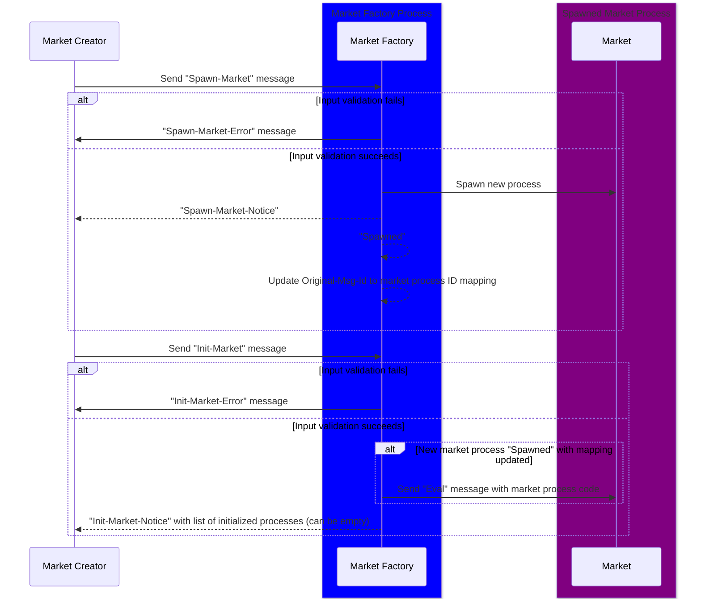

```mermaid
sequenceDiagram
participant Market Creator
box Blue Market Factory Process
  participant Market Factory
end
box Purple Spawned Market Process
  participant Market
end

%% 🟢 Spawn Market Request
Market Creator ->> Market Factory: Send "Spawn-Market" message

alt Input validation fails
  %% ❌ Error Notice
  Market Factory ->> Market Creator: "Spawn-Market-Error" message
else Input validation succeeds
  %% ✨ Create New Market Process
  Market Factory ->> Market: Spawn new process
  Market Factory -->> Market Creator: "Spawn-Market-Notice"

  %% 🔁 Update Market Mapping
  Market Factory -->> Market Factory: "Spawned"
  Market Factory -->> Market Factory: Update Original-Msg-Id to market process ID mapping
end

%% 💾 Init Market Request
Market Creator ->> Market Factory: Send "Init-Market" message

alt Input validation fails
  %% ❌ Error Notice
  Market Factory ->> Market Creator: "Init-Market-Error" message
else Input validation succeeds
  alt New market process "Spawned" with mapping updated
    %% 🚀 Load & Execute Market Process Code
    Market Factory ->> Market: Send "Eval" message with market process code
  end

  %% ✅ Completion Notice
  Market Factory -->> Market Creator: "Init-Market-Notice" with list of initialized processes (can be empty)
end
```