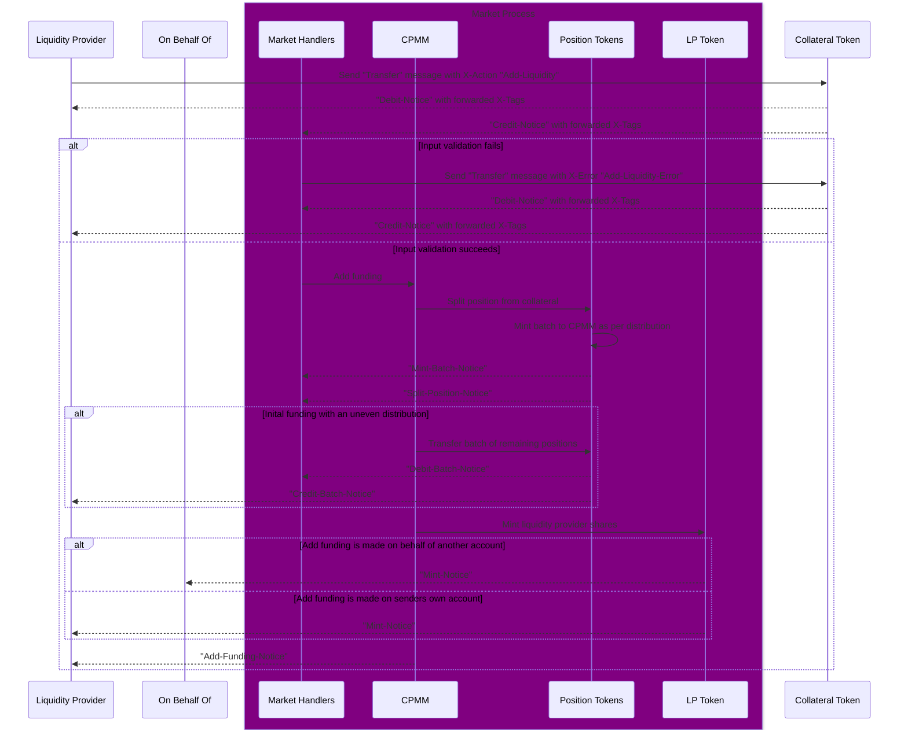

```mermaid
sequenceDiagram
participant Liquidity Provider
participant On Behalf Of
box Purple Market Process
participant Market Handlers
participant CPMM
participant Position Tokens
participant LP Token
end
participant Collateral Token


Liquidity Provider ->> Collateral Token: Send "Transfer" message with X-Action "Add-Liquidity"
Collateral Token -->> Liquidity Provider: "Debit-Notice" with forwarded X-Tags
Collateral Token -->> Market Handlers: "Credit-Notice" with forwarded X-Tags
alt Input validation fails
  Market Handlers ->> Collateral Token: Send "Transfer" message with X-Error "Add-Liquidity-Error"
  Collateral Token -->> Market Handlers: "Debit-Notice" with forwarded X-Tags
  Collateral Token -->> Liquidity Provider: "Credit-Notice" with forwarded X-Tags
else Input validation succeeds
  Market Handlers ->> CPMM: Add funding
  CPMM ->> Position Tokens: Split position from collateral
  Position Tokens ->> Position Tokens: Mint batch to CPMM as per distribution
  Position Tokens -->> Market Handlers: "Mint-Batch-Notice"
  Position Tokens -->> Market Handlers: "Split-Position-Notice"
  alt Inital funding with an uneven distribution
    CPMM ->> Position Tokens: Transfer batch of remaining positions
    Position Tokens -->> Market Handlers: "Debit-Batch-Notice"
    Position Tokens -->> Liquidity Provider: "Credit-Batch-Notice"
  end
  CPMM ->> LP Token: Mint liquidity provider shares
  alt Add funding is made on behalf of another account
    LP Token -->> On Behalf Of: "Mint-Notice"
  else Add funding is made on senders own account
    LP Token -->> Liquidity Provider: "Mint-Notice"
  end
  CPMM -->> Liquidity Provider: "Add-Funding-Notice"
end
```