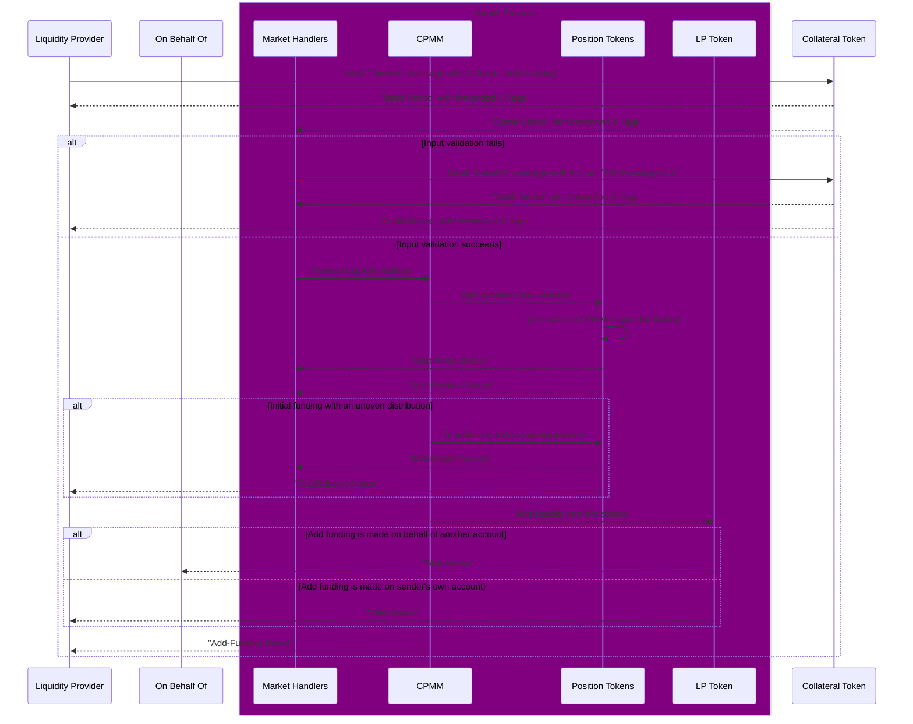

```mermaid
sequenceDiagram
participant Liquidity Provider
participant On Behalf Of
box Purple Market Process
  participant Market Handlers
  participant CPMM
  participant Position Tokens
  participant LP Token
end
participant Collateral Token

%% 🟢 Add Liquidity Request
Liquidity Provider ->> Collateral Token: Send "Transfer" message with X-Action "Add-Funding"
Collateral Token -->> Liquidity Provider: "Debit-Notice" with forwarded X-Tags
Collateral Token -->> Market Handlers: "Credit-Notice" with forwarded X-Tags

alt Input validation fails
  %% ⌠Error Notice
  Market Handlers ->> Collateral Token: Send "Transfer" message with X-Error "Add-Funidng-Error"
  Collateral Token -->> Market Handlers: "Debit-Notice" with forwarded X-Tags
  Collateral Token -->> Liquidity Provider: "Credit-Notice" with forwarded X-Tags
else Input validation succeeds
  Market Handlers ->> CPMM: Process Liquidity Addition

  %% ðŸŽŸï¸ Split & Mint Positions
  CPMM ->> Position Tokens: Split position from collateral
  Position Tokens ->> Position Tokens: Mint batch to CPMM as per distribution
  Position Tokens -->> Market Handlers: "Mint-Batch-Notice"
  Position Tokens -->> Market Handlers: "Split-Position-Notice"

  alt Initial funding with an uneven distribution
    %% 🔥 Batch Transfer of Remaining Positions
    CPMM ->> Position Tokens: Transfer batch of remaining positions
    Position Tokens -->> Market Handlers: "Debit-Batch-Notice"
    Position Tokens -->> Liquidity Provider: "Credit-Batch-Notice"
  end

  %% ðŸŽŸï¸ Mint Liquidity Provider Shares
  CPMM ->> LP Token: Mint liquidity provider shares

  alt Add funding is made on behalf of another account
    LP Token -->> On Behalf Of: "Mint-Notice"
  else Add funding is made on sender's own account
    LP Token -->> Liquidity Provider: "Mint-Notice"
  end

  %% ✅ Completion Notice
  CPMM -->> Liquidity Provider: "Add-Funding-Notice"
end
```