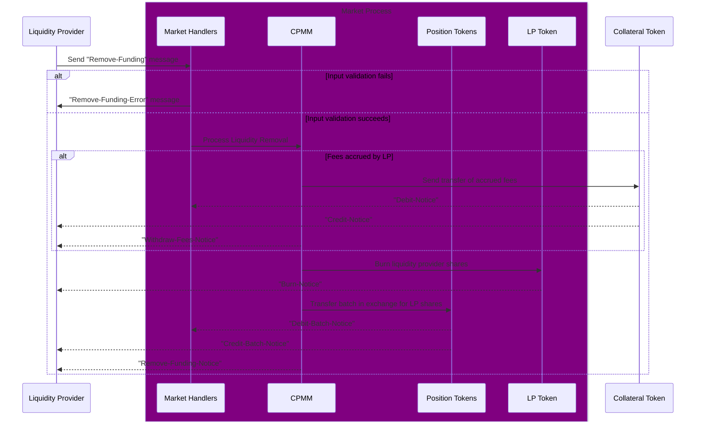

```mermaid
sequenceDiagram
participant Liquidity Provider
box Purple Market Process
  participant Market Handlers
  participant CPMM
  participant Position Tokens
  participant LP Token
end
participant Collateral Token

%% 🟢 Remove Funding Request
Liquidity Provider ->> Market Handlers: Send "Remove-Funding" message

alt Input validation fails
  %% ❌ Error Notice
  Market Handlers ->> Liquidity Provider: "Remove-Funding-Error" message
else Input validation succeeds
  Market Handlers ->> CPMM: Process Liquidity Removal

  alt Fees accrued by LP
    %% 💵 Withdraw Accrued Fees
    CPMM ->> Collateral Token: Send transfer of accrued fees
    Collateral Token -->> Market Handlers: "Debit-Notice"
    Collateral Token -->> Liquidity Provider: "Credit-Notice"
    CPMM -->> Liquidity Provider: "Withdraw-Fees-Notice"
  end

  %% 🔥 Burn LP Shares & Redeem Positions
  CPMM ->> LP Token: Burn liquidity provider shares
  LP Token -->> Liquidity Provider: "Burn-Notice"

  %% 🎟️ Exchange LP Shares for Positions
  CPMM ->> Position Tokens: Transfer batch in exchange for LP shares
  Position Tokens -->> Market Handlers: "Debit-Batch-Notice"
  Position Tokens -->> Liquidity Provider: "Credit-Batch-Notice"

  %% ✅ Completion Notice
  CPMM -->> Liquidity Provider: "Remove-Funding-Notice"
end

```