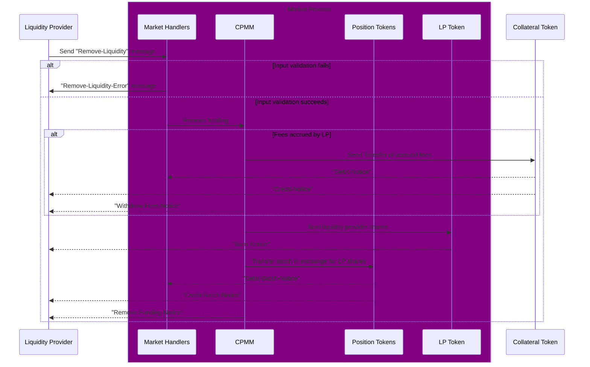

```mermaid
sequenceDiagram
participant Liquidity Provider
box Purple Market Process
participant Market Handlers
participant CPMM
participant Position Tokens
participant LP Token
end
participant Collateral Token


Liquidity Provider ->> Market Handlers: Send "Remove-Liquidity" message
alt Input validation fails
  Market Handlers ->> Liquidity Provider: "Remove-Liquidity-Error" message
else Input validation succeeds
  Market Handlers ->> CPMM: Remove funding
  alt Fees accrued by LP
    CPMM ->> Collateral Token: Send Transfer of accrued fees
    Collateral Token -->> Market Handlers: "Debit-Notice"
    Collateral Token -->> Liquidity Provider: "Credit-Notice"
    CPMM -->> Liquidity Provider: "Withdraw-Fees-Notice"
  end
  CPMM ->> LP Token: Burn liquidity provider shares
  LP Token -->> Liquidity Provider: "Burn-Notice"
  CPMM ->> Position Tokens: Transfer batch in exchange for LP shares
  Position Tokens -->> Market Handlers: "Debit-Batch-Notice"
  Position Tokens -->> Liquidity Provider: "Credit-Batch-Notice"
  CPMM -->> Liquidity Provider: "Remove-Funding-Notice"
end
```