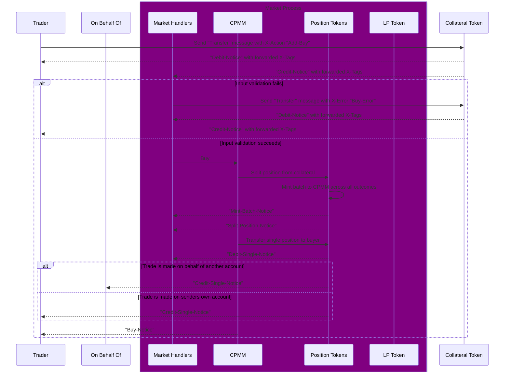

```mermaid
sequenceDiagram
participant Trader
participant On Behalf Of
box Purple Market Process
participant Market Handlers
participant CPMM
participant Position Tokens
participant LP Token
end
participant Collateral Token


Trader ->> Collateral Token: Send "Transfer" message with X-Action "Add-Buy"
Collateral Token -->> Trader: "Debit-Notice" with forwarded X-Tags
Collateral Token -->> Market Handlers: "Credit-Notice" with forwarded X-Tags
alt Input validation fails
  Market Handlers ->> Collateral Token: Send "Transfer" message with X-Error "Buy-Error"
  Collateral Token -->> Market Handlers: "Debit-Notice" with forwarded X-Tags
  Collateral Token -->> Trader: "Credit-Notice" with forwarded X-Tags
else Input validation succeeds
  Market Handlers ->> CPMM: Buy
  CPMM ->> Position Tokens: Split position from collateral
  Position Tokens ->> Position Tokens: Mint batch to CPMM across all outcomes
  Position Tokens -->> Market Handlers: "Mint-Batch-Notice"
  Position Tokens -->> Market Handlers: "Split-Position-Notice"
  CPMM ->> Position Tokens: Transfer single position to buyer
  Position Tokens -->> Market Handlers: "Debit-Single-Notice"
  alt Trade is made on behalf of another account
    Position Tokens -->> On Behalf Of: "Credit-Single-Notice"
  else Trade is made on senders own account
    Position Tokens -->> Trader: "Credit-Single-Notice"
  end
  CPMM -->> Trader: "Buy-Notice"
end
```