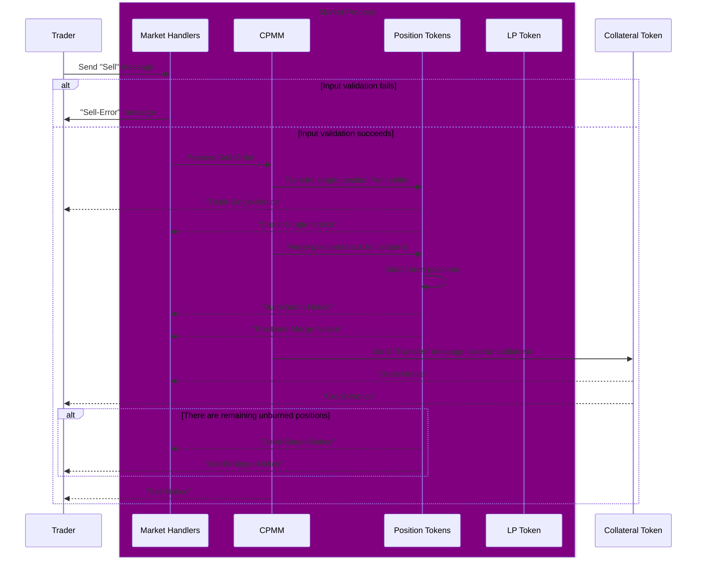

```mermaid
sequenceDiagram
participant Trader
box Purple Market Process
  participant Market Handlers
  participant CPMM
  participant Position Tokens
  participant LP Token
end
participant Collateral Token

%% 🟢 Sell Request
Trader ->> Market Handlers: Send "Sell" message

alt Input validation fails
  %% ⌠Error Notice
  Market Handlers ->> Trader: "Sell-Error" message
else Input validation succeeds
  Market Handlers ->> CPMM: Process Sell Order

  %% ðŸŽŸï¸ Transfer Position from Seller
  CPMM ->> Position Tokens: Transfer single position from seller
  Position Tokens -->> Trader: "Debit-Single-Notice"
  Position Tokens -->> Market Handlers: "Credit-Single-Notice"

  %% 🔥 Merge & Burn Positions
  CPMM ->> Position Tokens: Merge positions back to collateral
  Position Tokens ->> Position Tokens: Batch burn positions
  Position Tokens -->> Market Handlers: "Burn-Batch-Notice"
  Position Tokens -->> Market Handlers: "Positions-Merge-Notice"

  %% 💵 Transfer Collateral to Seller
  CPMM ->> Collateral Token: Send "Transfer" message to return collateral
  Collateral Token -->> Market Handlers: "Debit-Notice"
  Collateral Token -->> Trader: "Credit-Notice"

  alt There are remaining unburned positions
    Position Tokens -->> Market Handlers: "Debit-Single-Notice"
    Position Tokens -->> Trader: "Credit-Single-Notice"
  end

  %% ✅ Completion Notice
  CPMM -->> Trader: "Sell-Notice"
end
```