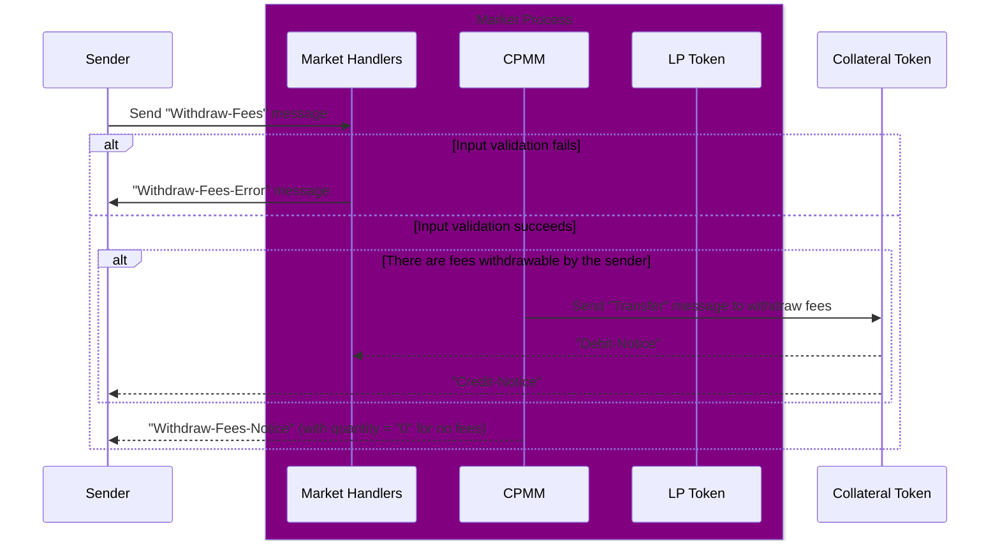

```mermaid
sequenceDiagram
participant Sender
box Purple Market Process
participant Market Handlers
participant CPMM
participant LP Token
end
participant Collateral Token

Sender ->> Market Handlers: Send "Withdraw-Fees" message
alt Input validation fails
  Market Handlers ->> Sender: "Withdraw-Fees-Error" message
else Input validation succeeds
  alt There are fees withdrawable by the sender
    CPMM ->> Collateral Token: Send "Transfer" message to withdraw fees
    Collateral Token -->> Market Handlers: "Debit-Notice"
    Collateral Token -->> Sender: "Credit-Notice"
  end
  CPMM -->> Sender: "Withdraw-Fees-Notice" (with quantity = "0" for no fees)
end
```