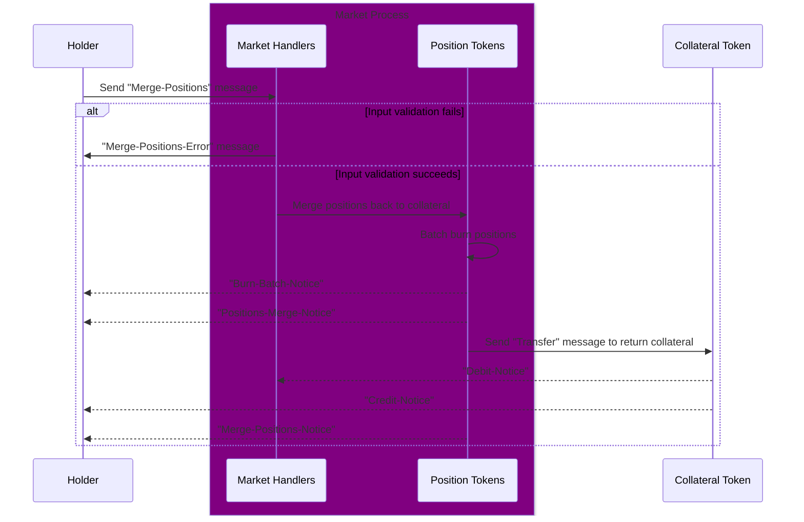

```mermaid
sequenceDiagram
participant Holder
box Purple Market Process
participant Market Handlers
participant Position Tokens
end
participant Collateral Token


Holder ->> Market Handlers: Send "Merge-Positions" message
alt Input validation fails
  Market Handlers ->> Holder: "Merge-Positions-Error" message
else Input validation succeeds
  Market Handlers ->> Position Tokens: Merge positions back to collateral
  Position Tokens ->> Position Tokens: Batch burn positions
  Position Tokens -->> Holder: "Burn-Batch-Notice"
  Position Tokens -->> Holder: "Positions-Merge-Notice"
  Position Tokens ->> Collateral Token: Send "Transfer" message to return collateral
  Collateral Token -->> Market Handlers: "Debit-Notice"
  Collateral Token -->> Holder: "Credit-Notice"
  Position Tokens -->> Holder: "Merge-Positions-Notice"
end
```