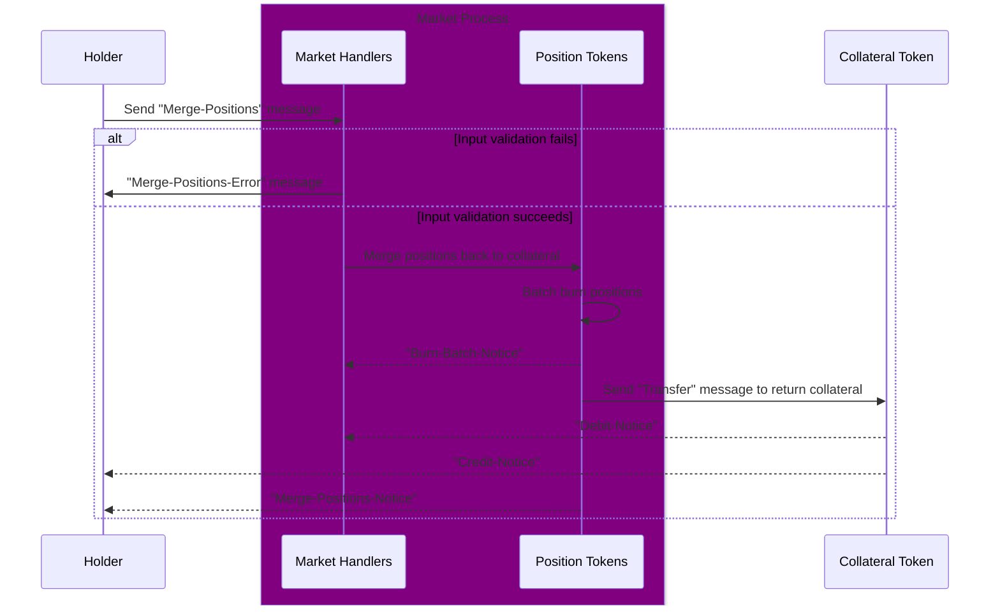

```mermaid
sequenceDiagram
participant Holder
box Purple Market Process
  participant Market Handlers
  participant Position Tokens
end
participant Collateral Token

%% 🟢 Merge Request
Holder ->> Market Handlers: Send "Merge-Positions" message

alt Input validation fails
  %% ❌ Error Notice
  Market Handlers ->> Holder: "Merge-Positions-Error" message
else Input validation succeeds
  Market Handlers ->> Position Tokens: Merge positions back to collateral

  %% 🔥 Batch Burn Positions
  Position Tokens ->> Position Tokens: Batch burn positions
  Position Tokens -->> Market Handlers: "Burn-Batch-Notice"

  %% 💵 Transfer Collateral Back
  Position Tokens ->> Collateral Token: Send "Transfer" message to return collateral
  Collateral Token -->> Market Handlers: "Debit-Notice"
  Collateral Token -->> Holder: "Credit-Notice"

  %% ✅ Completion Notice
  Position Tokens -->> Holder: "Merge-Positions-Notice"
end
```