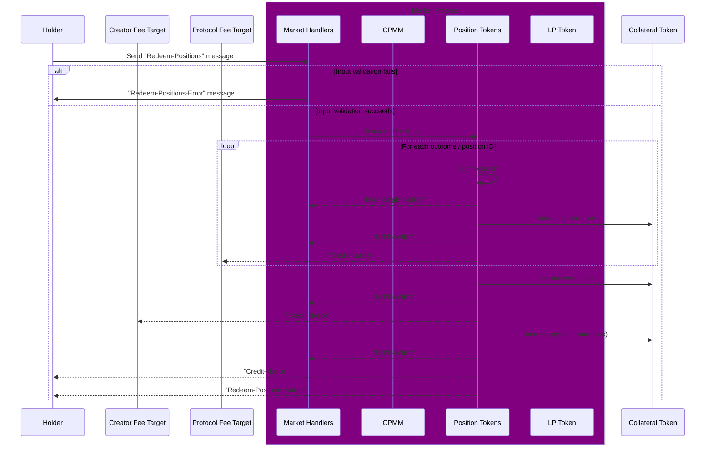

```mermaid
sequenceDiagram
participant Holder
participant Creator Fee Target
participant Protocol Fee Target
box Purple Market Process
  participant Market Handlers
  participant CPMM
  participant Position Tokens
  participant LP Token
end
participant Collateral Token

%% 🟢 Redeem Request
Holder ->> Market Handlers: Send "Redeem-Positions" message

alt Input validation fails
  %% ❌ Error Notice
  Market Handlers ->> Holder: "Redeem-Positions-Error" message
else Input validation succeeds
  Market Handlers ->> Position Tokens: Redeem Positions

  %% 🔄 Loop: Burn each Position Token
  loop For each outcome / position ID
    Position Tokens ->> Position Tokens: Burn position
    Position Tokens -->> Market Handlers: "Burn-Single-Notice"

    %% 💵 Protocol Fee Deduction
    Position Tokens ->> Collateral Token: Transfer protocol fee
    Position Tokens -->> Market Handlers: "Debit-Notice"
    Position Tokens -->> Protocol Fee Target: "Credit-Notice"
  end

  %% 💵 Creator Fee Deduction
  Position Tokens ->> Collateral Token: Transfer creator fee
  Position Tokens -->> Market Handlers: "Debit-Notice"
  Position Tokens -->> Creator Fee Target: "Credit-Notice"

  %% 💰 Final Payout to Holder (Minus Fees)
  Position Tokens ->> Collateral Token: Transfer payout (minus fees)
  Position Tokens -->> Market Handlers: "Debit-Notice"
  Position Tokens -->> Holder: "Credit-Notice"

  %% ✅ Completion Notice
  Position Tokens -->> Holder: "Redeem-Positions-Notice"
end

```