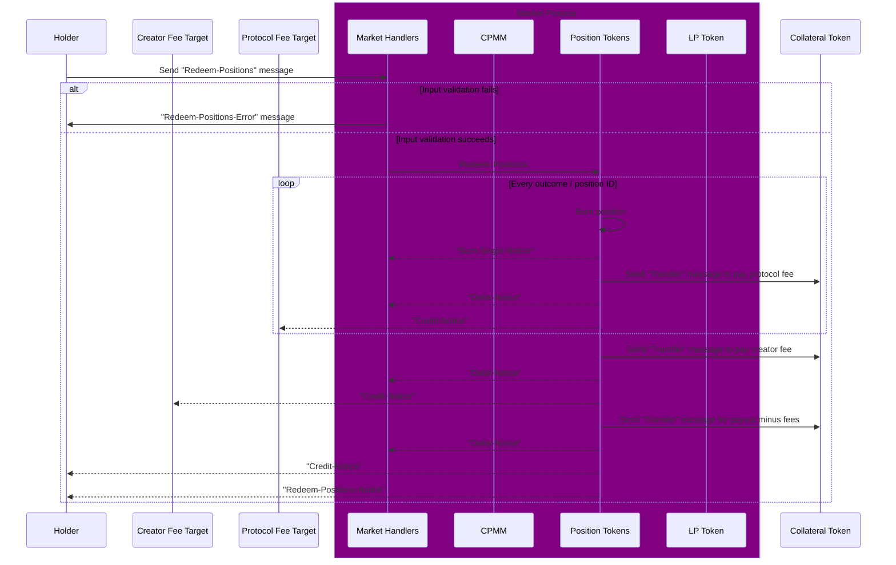

```mermaid
sequenceDiagram
participant Holder
participant Creator Fee Target
participant Protocol Fee Target
box Purple Market Process
participant Market Handlers
participant CPMM
participant Position Tokens
participant LP Token
end
participant Collateral Token


Holder ->> Market Handlers: Send "Redeem-Positions" message
alt Input validation fails
  Market Handlers ->> Holder: "Redeem-Positions-Error" message
else Input validation succeeds
  Market Handlers ->> Position Tokens: Redeem Positions
  loop Every outcome / position ID
    Position Tokens ->> Position Tokens: Burn position
    Position Tokens -->> Market Handlers: "Burn-Single-Notice"
    Position Tokens ->> Collateral Token: Send "Transfer" message to pay protocol fee
    Position Tokens -->> Market Handlers: "Debit-Notice"
    Position Tokens -->> Protocol Fee Target: "Credit-Notice"
  end
  Position Tokens ->> Collateral Token: Send "Transfer" message to pay creator fee
  Position Tokens -->> Market Handlers: "Debit-Notice"
  Position Tokens -->> Creator Fee Target: "Credit-Notice"
  Position Tokens ->> Collateral Token: Send "Transfer" message for payout minus fees
  Position Tokens -->> Market Handlers: "Debit-Notice"
  Position Tokens -->> Holder: "Credit-Notice"
  Position Tokens -->> Holder: "Redeem-Positions-Notice"
end
```