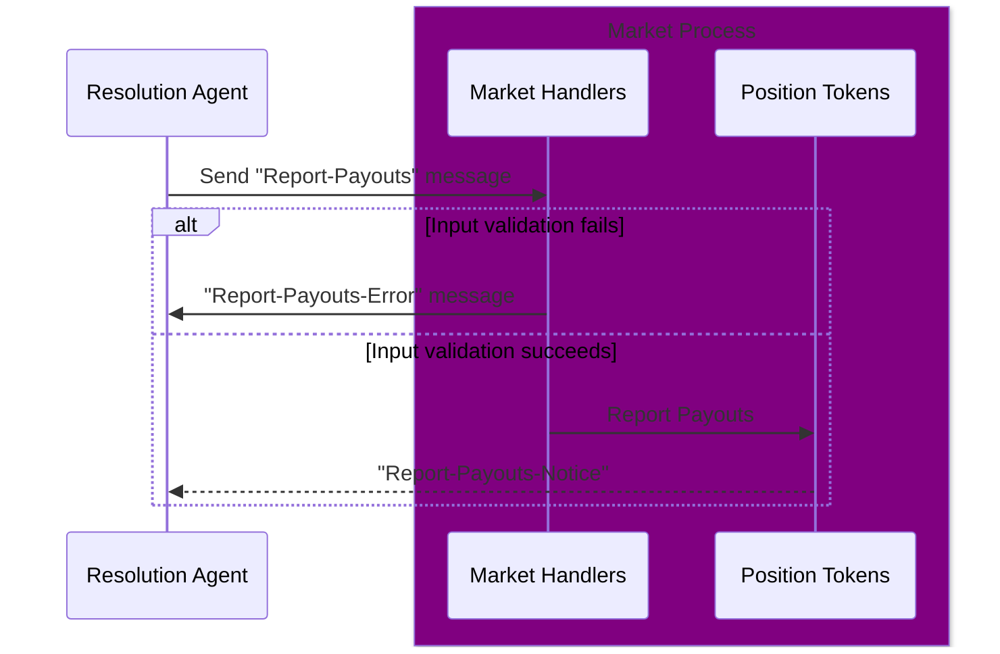

```mermaid
sequenceDiagram
participant Resolution Agent
box Purple Market Process
  participant Market Handlers
  participant Position Tokens
end

%% 🟢 Report Payouts Request
Resolution Agent ->> Market Handlers: Send "Report-Payouts" message

alt Input validation fails
  %% ❌ Error Notice
  Market Handlers ->> Resolution Agent: "Report-Payouts-Error" message
else Input validation succeeds
  Market Handlers ->> Position Tokens: Report Payouts
  %% ✅ Completion Notice
  Position Tokens -->> Resolution Agent: "Report-Payouts-Notice"
end
```