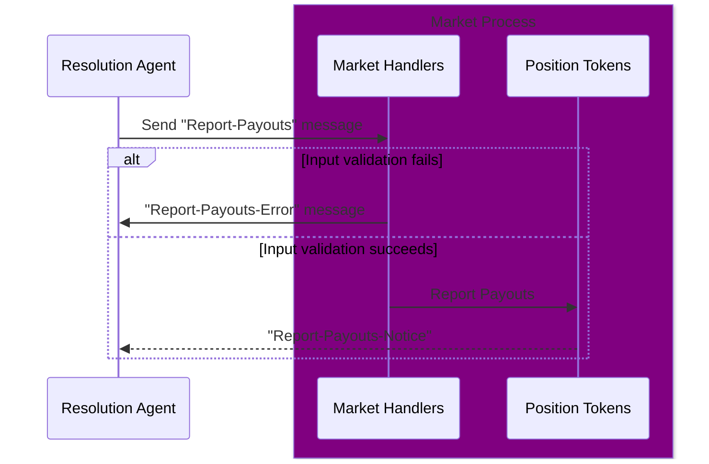

```mermaid
sequenceDiagram
participant Resolution Agent
box Purple Market Process
participant Market Handlers
participant Position Tokens
end

Resolution Agent ->> Market Handlers: Send "Report-Payouts" message
alt Input validation fails
  Market Handlers ->> Resolution Agent: "Report-Payouts-Error" message
else Input validation succeeds
  Market Handlers ->> Position Tokens: Report Payouts
  Position Tokens -->> Resolution Agent: "Report-Payouts-Notice"
end
```