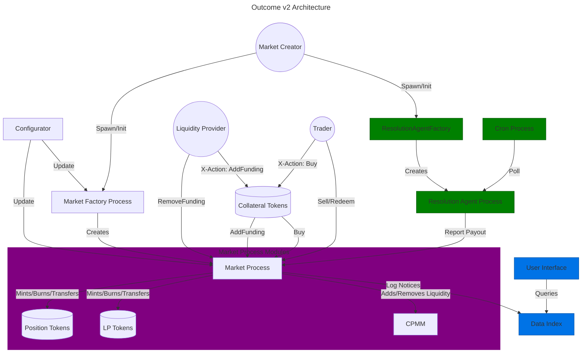

```mermaid
---
title: Outcome v2 Architecture 
description: |
  🟣 Core Processes (Market Process & Modules)
  🔵 UI Components (User Interface & Data Index)
  🟢 Autonomous Resolution Processes (Resolution Agent, Resolution Agent Factory, Cron)
---

graph TD
  %% 🔧 Configurator (System Updates)
  Configurator[Configurator] --> |Update| Market
  Configurator --> |Update| MarketFactory[Market Factory Process]

  %% 🏗 Market Creation Flow
  MarketCreator((Market Creator)) -->|Spawn/Init| MarketFactory
  MarketFactory -->|Creates| Market[Market Process]

  %% 🔍 Resolution Agent Flow
  MarketCreator -->|Spawn/Init| ResolutionAgentFactory
  ResolutionAgentFactory -->|Creates| ResolutionAgent[Resolution Agent Process]

  %% 💰 Liquidity Provider -> Market
  LiquidityProvider((Liquidity Provider)) -->|RemoveFunding| Market
  LiquidityProvider -->|X-Action: AddFunding| CollateralTokens[(Collateral Tokens)]
  CollateralTokens -->|AddFunding| Market

  %% 📈 Trader -> Market
  Trader((Trader)) -->|X-Action: Buy| CollateralTokens
  CollateralTokens -->|Buy| Market
  Trader -->|Sell/Redeem| Market

  %% 🟣 Market Process Modules
  subgraph MarketModules[Market Process Modules]
    Market --> |Mints/Burns/Transfers| PositionTokens[(Position Tokens)]
    Market -->|Mints/Burns/Transfers| LpTokens[(LP Tokens)]
    Market -->|Adds/Removes Liquidity| CPMM[CPMM]
  end

  %% 🟢 Resolution Agent Process
  ResolutionAgent -->|Report Payout| Market
  Cron[Cron Process] --> |Poll| ResolutionAgent

  %% 🔵 Data Indexing & UI
  Client[User Interface] -->|Queries| DataIndex[Data Index]
  Market -->|Log Notices| DataIndex

  %% 🖌 Styling for Readability
  style MarketModules fill:#800080,stroke:#800080,stroke-width:2px  %% Purple
  style ResolutionAgentFactory fill:#008000,stroke:#005000,stroke-width:2px  %% Green
  style ResolutionAgent fill:#008000,stroke:#005000,stroke-width:2px  %% Green
  style Cron fill:#008000,stroke:#005000,stroke-width:2px  %% Green
  style Client fill:#0073E6,stroke:#0050A0,stroke-width:2px  %% Blue
  style DataIndex fill:#0073E6,stroke:#0050A0,stroke-width:2px  %% Blue
```