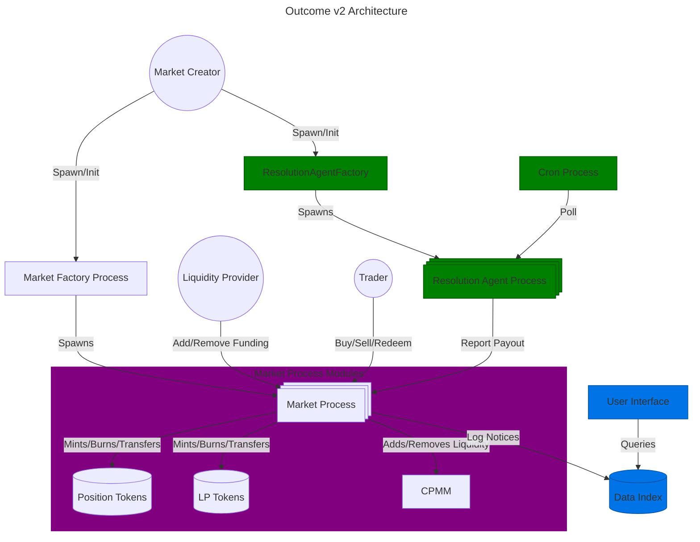

```mermaid
---
title: Outcome v2 Architecture 
description: |
  🟣 Core Processes (Market Process & Modules)
  🔵 UI Components (User Interface & Data Index)
  🟢 Autonomous Resolution Processes (Resolution Agent, Resolution Agent Factory, Cron)
---

graph TD
  %% Market Creator -> Market Factory -> Market
  MarketCreator((Market Creator)) -->|Spawn/Init| MarketFactory[Market Factory Process]
  MarketFactory -->|Spawns| Market@{ shape: procs, label: "Market Process"}

  %% Market Creator -> Resolution Agent Factory -> Resolution Agent
  MarketCreator -->|Spawn/Init| ResolutionAgentFactory
  ResolutionAgentFactory -->|Spawns| ResolutionAgent@{ shape: procs, label: "Market Process"}

  %% Liqudity Provider -> Market
  LiquidityProvider((Liquidity Provider)) -->|Add/Remove Funding| Market

  %% Trader-> Market
  Trader((Trader))  -->|Buy/Sell/Redeem| Market

  %% Define Market Process Modules
  subgraph MarketSubgraph[Market Process Modules]
    Market --> |Mints/Burns/Transfers| PositionTokens[(Position Tokens)]
    Market -->|Mints/Burns/Transfers| LpTokens[(LP Tokens)]
    Market -->|Adds/Removes Liquidity| CPMM[CPMM]
  end

  %% Resolution
  ResolutionAgent@{ shape: procs, label: "Resolution Agent Process"} -->|Report Payout| Market
  Cron[Cron Process] --> |Poll| ResolutionAgent

  %% Data Indexing
  Client[User Interface] -->|Queries| DataIndex
  Market -->|Log Notices| DataIndex[(Data Index)]

  %% Styling
  style MarketSubgraph fill:#800080,stroke:#800080,stroke-width:2px %% Purple
  style ResolutionAgentFactory fill:#008000,stroke:#005000,stroke-width:2px  %% Green
  style ResolutionAgent fill:#008000,stroke:#005000,stroke-width:2px  %% Green
  style Cron fill:#008000,stroke:#005000,stroke-width:2px  %% Green
  style Client fill:#0073E6,stroke:#0050A0,stroke-width:2px  %% Blue
  style DataIndex fill:#0073E6,stroke:#0050A0,stroke-width:2px  %% Blue
```